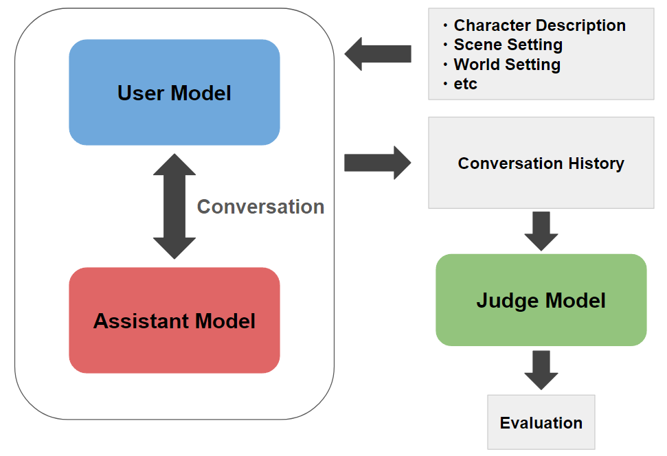

# Japanese-RP-Bench



## 概要

Japanese-RP-BenchはLLMの日本語ロールプレイ能力を測定するためのベンチマークです。詳細な情報については[こちらの記事](https://zenn.dev/aratako_lm/articles/42ad1a6ac9da45)をご確認ください。

システムとしての流れは大きく以下の通りです。

1. ロールプレイ設定のデータセットをロード
2. ロールプレイ設定からユーザー側モデル用、アシスタント側モデル用のシステムプロンプトを構築
3. 構築したシステムプロンプトを元に、ユーザーとアシスタント役の2つのLLMで複数ターン（デフォルトは10ターン）のロールプレイ対話を実行
4. 出来上がった対話内のアシスタントの発話部分を別のJudge Modelで評価
5. 全体のスコアを集計

自分でベンチマークを回したい方は[実行方法](#実行方法)の項目をご確認ください。

## 評価項目

ベンチマークにおける評価項目は以下の8個です。

- Roleplay Adherence: アシスタントがロールプレイ設定を厳守し、一貫して1人のキャラクターとして応答しているかどうか。また、ユーザー側の発言や行動を描写せず、ロールプレイ設定で指定された会話形式を守れているかどうか
- Consistency: アシスタントがキャラクター設定に一貫して従い、対話全体に矛盾がないか。会話中に変化があっても、キャラクターの本質的部分を維持できているかどうか。
- Contextual Understanding: アシスタントが過去の発言や会話の文脈を正しく理解して応答をしているかどうか。設定にある情報を単に繰り返すのではなく新しい情報や提案を行い、それを巧みに取り入れて自然で深い応答を形成しているかどうか。
- Expressiveness: アシスタントがキャラクターの台詞、感情、トーンなどを豊かに表現しているかどうか。シーンに応じて適切に表現を変化させているか。また、単純な喜怒哀楽だけでなく、複雑で微妙な感情の変化も深く描写できているかどうか。
- Creativity:  アシスタントの応答が独創的で機械的でないかどうか。単調な応答ではなく、興味深く魅力的な会話を展開できているか。また、ユーザーとのやり取りで意外な視点やアイデアを提供できているかどうか。
- Naturalness of Japanese: アシスタントの応答が自然な日本語で書かれているかどうか。不自然な言い回し、機械的な表現、他の言語の混入がないか。文法や語彙の選択が適切で、スムーズで読みやすい文章かどうか。また、同じフレーズや表現の繰り返しを避けているかどうか。
- Enjoyment of the Dialogue: 客観的に見て、アシスタントの応答が楽しい会話を生み出しているかどうか。ユーモアや機知に富んだ、魅力的な会話体験をユーザーに提供できているか。

実際に使われている評価プロンプトは[こちら](prompts/eval_prompt_SFW.txt)をご確認ください。

## 評価結果

以下の条件で本ベンチマークを実行した結果です。

- ユーザー側のモデルには`anthropic.claude-3-5-sonnet-20240620-v1:0`を利用
- 評価には`gpt-4o-2024-08-06`、`o1-mini-2024-09-12`、`anthropic.claude-3-5-sonnet-20240620-v1:0`、`gemini-1.5-pro-002`の4モデルによる評価値の平均を採用

| target_model_name                               |   Overall Average |   Roleplay Adherence |   Consistency |   Contextual Understanding |   Expressiveness |   Creativity |   Naturalness of Japanese |   Enjoyment of the Dialogue |   Appropriateness of Turn-Taking |
|:------------------------------------------------|------------------:|---------------------:|--------------:|---------------------------:|-----------------:|-------------:|--------------------------:|----------------------------:|---------------------------------:|
| claude-3-opus-20240229                          |             4.403 |                4.6   |         4.792 |                      4.625 |            4.092 |        3.833 |                     4.8   |                       4.083 |                            4.4   |
| claude-3-5-sonnet-20240620                      |             4.397 |                4.592 |         4.708 |                      4.617 |            4.025 |        3.967 |                     4.742 |                       4.117 |                            4.408 |
| gpt-4o-mini-2024-07-18                          |             4.324 |                4.692 |         4.708 |                      4.575 |            3.883 |        3.642 |                     4.717 |                       3.85  |                            4.525 |
| gemini-1.5-pro-002                              |             4.268 |                4.633 |         4.683 |                      4.467 |            3.858 |        3.658 |                     4.658 |                       3.817 |                            4.367 |
| cyberagent/Mistral-Nemo-Japanese-Instruct-2408  |             4.266 |                4.508 |         4.642 |                      4.533 |            3.85  |        3.658 |                     4.675 |                       3.892 |                            4.367 |
| gpt-4o-2024-08-06                               |             4.242 |                4.617 |         4.642 |                      4.5   |            3.75  |        3.542 |                     4.708 |                       3.75  |                            4.425 |
| command-r-plus-08-2024                          |             4.216 |                4.617 |         4.633 |                      4.425 |            3.708 |        3.55  |                     4.65  |                       3.733 |                            4.408 |
| Qwen/Qwen2.5-72B-Instruct                       |             4.206 |                4.658 |         4.65  |                      4.458 |            3.725 |        3.533 |                     4.608 |                       3.692 |                            4.325 |
| gemini-1.5-pro                                  |             4.203 |                4.475 |         4.6   |                      4.425 |            3.775 |        3.558 |                     4.65  |                       3.725 |                            4.417 |
| o1-preview-2024-09-12                           |             4.179 |                4.625 |         4.65  |                      4.383 |            3.642 |        3.417 |                     4.6   |                       3.617 |                            4.5   |
| gemini-1.5-flash-002                            |             4.162 |                4.675 |         4.633 |                      4.333 |            3.683 |        3.4   |                     4.542 |                       3.633 |                            4.4   |
| claude-3-haiku-20240307                         |             4.15  |                4.35  |         4.608 |                      4.358 |            3.8   |        3.483 |                     4.608 |                       3.708 |                            4.283 |
| Qwen/Qwen2.5-32B-Instruct                       |             4.132 |                4.525 |         4.617 |                      4.408 |            3.65  |        3.45  |                     4.508 |                       3.533 |                            4.367 |
| o1-mini-2024-09-12                              |             4.117 |                4.675 |         4.6   |                      4.367 |            3.475 |        3.392 |                     4.583 |                       3.525 |                            4.317 |
| mistral-large-2407                              |             4.114 |                4.642 |         4.617 |                      4.367 |            3.525 |        3.325 |                     4.55  |                       3.558 |                            4.325 |
| cyberagent/calm3-22b-chat                       |             4.085 |                4.4   |         4.583 |                      4.35  |            3.583 |        3.475 |                     4.55  |                       3.6   |                            4.142 |
| google/gemma-2-27b-it                           |             4.06  |                4.442 |         4.575 |                      4.275 |            3.567 |        3.392 |                     4.542 |                       3.542 |                            4.142 |
| cyberagent/Llama-3.1-70B-Japanese-Instruct-2407 |             4.052 |                4.283 |         4.583 |                      4.3   |            3.625 |        3.45  |                     4.425 |                       3.6   |                            4.15  |
| Aratako/calm3-22b-RP-v2                         |             4.045 |                4.358 |         4.55  |                      4.225 |            3.6   |        3.342 |                     4.517 |                       3.592 |                            4.175 |
| command-r-08-2024                               |             4.038 |                4.4   |         4.567 |                      4.258 |            3.55  |        3.308 |                     4.508 |                       3.567 |                            4.15  |
| meta-llama/Meta-Llama-3.1-405B-Instruct         |             3.975 |                4.408 |         4.5   |                      4.258 |            3.483 |        3.25  |                     4.367 |                       3.442 |                            4.092 |
| gemini-1.5-flash                                |             3.88  |                4.467 |         4.467 |                      4.075 |            3.4   |        3.192 |                     4.183 |                       3.325 |                            3.933 |
| deepseek-chat                                   |             3.794 |                4.308 |         4.383 |                      4.008 |            3.308 |        2.992 |                     4.333 |                       3.15  |                            3.867 |
| mistralai/Mistral-Small-Instruct-2409           |             3.749 |                4.225 |         4.35  |                      3.967 |            3.258 |        2.942 |                     4.083 |                       3.192 |                            3.975 |
| weblab-GENIAC/Tanuki-8B-dpo-v1.0                |             3.695 |                3.817 |         4.1   |                      3.983 |            3.317 |        3.233 |                     4.183 |                       3.308 |                            3.617 |
| nitky/Oumuamua-7b-instruct-v2                   |             3.686 |                3.742 |         4.242 |                      3.958 |            3.325 |        3.067 |                     4.15  |                       3.275 |                            3.733 |
| elyza/Llama-3-ELYZA-JP-8B                       |             3.673 |                4.2   |         4.408 |                      3.817 |            3.067 |        2.858 |                     4.217 |                       3.108 |                            3.708 |
| Qwen/Qwen2.5-7B-Instruct                        |             3.661 |                3.867 |         4.175 |                      3.975 |            3.275 |        3.008 |                     3.983 |                       3.2   |                            3.808 |
| mistralai/Mistral-Nemo-Instruct-2407            |             3.535 |                3.808 |         4.058 |                      3.842 |            3.175 |        3.042 |                     3.433 |                       3.133 |                            3.792 |
| meta-llama/Meta-Llama-3.1-70B-Instruct          |             3.517 |                4.117 |         4.208 |                      3.675 |            2.975 |        2.708 |                     3.958 |                       2.892 |                            3.6   |
| tokyotech-llm/Llama-3-Swallow-8B-Instruct-v0.1  |             3.271 |                3.8   |         4.008 |                      3.4   |            2.717 |        2.483 |                     3.708 |                       2.642 |                            3.408 |
| meta-llama/Meta-Llama-3.1-8B-Instruct           |             2.986 |                3.475 |         3.775 |                      3.042 |            2.533 |        2.25  |                     3.4   |                       2.442 |                            2.967 |

また、50件のデータに対して人手評価を行い算出した人手評価とLLM評価とのスピアマン順位相関係数は以下の通りです。（Overallは4モデルの評価値の平均、それ以外は列名のモデルの評価値の平均）

今回の例では4つのモデルの平均が最も相関係数が高かったので、こちらの評価を採用しました。

|                                |   Overall |   gpt-4o-2024-08-06 |   o1-mini-2024-09-12 |   anthropic.claude-3-5-sonnet-20240620-v1:0 |   gemini-1.5-pro-002 |   gpt-4o-2024-08-06_o1-mini-2024-09-12 |   gpt-4o-2024-08-06_anthropic.claude-3-5-sonnet-20240620-v1:0 |   gpt-4o-2024-08-06_gemini-1.5-pro-002 |   o1-mini-2024-09-12_anthropic.claude-3-5-sonnet-20240620-v1:0 |   o1-mini-2024-09-12_gemini-1.5-pro-002 |   anthropic.claude-3-5-sonnet-20240620-v1:0_gemini-1.5-pro-002 |   gpt-4o-2024-08-06_o1-mini-2024-09-12_anthropic.claude-3-5-sonnet-20240620-v1:0 |   gpt-4o-2024-08-06_o1-mini-2024-09-12_gemini-1.5-pro-002 |   gpt-4o-2024-08-06_anthropic.claude-3-5-sonnet-20240620-v1:0_gemini-1.5-pro-002 |   o1-mini-2024-09-12_anthropic.claude-3-5-sonnet-20240620-v1:0_gemini-1.5-pro-002 |
|:-------------------------------|----------:|--------------------:|---------------------:|--------------------------------------------:|---------------------:|---------------------------------------:|--------------------------------------------------------------:|---------------------------------------:|---------------------------------------------------------------:|----------------------------------------:|---------------------------------------------------------------:|---------------------------------------------------------------------------------:|----------------------------------------------------------:|---------------------------------------------------------------------------------:|----------------------------------------------------------------------------------:|
| Roleplay Adherence             |     0.632 |               0.473 |                0.46  |                                       0.29  |                0.54  |                                  0.604 |                                                         0.392 |                                  0.619 |                                                          0.479 |                                   0.63  |                                                          0.464 |                                                                            0.579 |                                                     **0.684** |                                                                            0.522 |                                                                             0.578 |
| Consistency                    |     0.52  |               0.576 |                0.501 |                                       0.195 |                0.446 |                                  **0.641** |                                                         0.412 |                                  0.566 |                                                          0.406 |                                   0.491 |                                                          0.287 |                                                                            0.554 |                                                     0.613 |                                                                            0.435 |                                                                             0.39  |
| Contextual Understanding       |     0.526 |               0.416 |                0.525 |                                       0.309 |                0.484 |                                  0.556 |                                                         0.393 |                                  0.498 |                                                          0.459 |                                   0.563 |                                                          0.403 |                                                                            0.507 |                                                     **0.586** |                                                                            0.45  |                                                                             0.496 |
| Expressiveness                 |     **0.56**  |               0.391 |                0.477 |                                       0.42  |                0.47  |                                  0.519 |                                                         0.494 |                                  0.503 |                                                          0.5   |                                   0.517 |                                                          0.474 |                                                                            0.55  |                                                     0.555 |                                                                            0.521 |                                                                             0.521 |
| Creativity                     |     0.43  |               0.347 |                0.294 |                                       0.396 |                **0.462** |                                  0.374 |                                                         0.42  |                                  0.427 |                                                          0.386 |                                   0.384 |                                                          0.422 |                                                                            0.406 |                                                     0.408 |                                                                            0.442 |                                                                             0.401 |
| Naturalness of Japanese        |     0.555 |               0.484 |                0.566 |                                       0.386 |                0.548 |                                  0.56  |                                                         0.494 |                                  0.545 |                                                          0.51  |                                   0.564 |                                                          0.515 |                                                                            0.541 |                                                     **0.566** |                                                                            0.545 |                                                                             0.544 |
| Enjoyment of the Dialogue      |     0.504 |               0.2   |                0.438 |                                       0.481 |                0.443 |                                  0.399 |                                                         0.437 |                                  0.376 |                                                          **0.525** |                                   0.475 |                                                          0.498 |                                                                            0.507 |                                                     0.442 |                                                                            0.463 |                                                                             0.524 |
| Appropriateness of Turn-Taking |     0.617 |               0.531 |                0.288 |                                       0.488 |                0.361 |                                  0.485 |                                                         0.604 |                                  0.573 |                                                          0.45  |                                   0.384 |                                                          0.491 |                                                                            0.577 |                                                     0.564 |                                                                            **0.635** |                                                                             0.482 |
| Average Score                  |     **0.601** |               0.426 |                0.463 |                                       0.427 |                0.554 |                                  0.547 |                                                         0.507 |                                  0.564 |                                                          0.503 |                                   0.56  |                                                          0.517 |                                                                            0.567 |                                                     0.599 |                                                                            0.554 |                                                                             0.549 |

生の評価結果は[こちら](evaluations)からご確認ください。

## 実行方法

1. ライブラリのインストール

   ```bash
   git clone https://github.com/Aratako/Japanese-RP-Bench.git
   cd Japanese-RP-Bench

   pip install -e .
   ```

2. YAML設定ファイルの作成

   [設定ファイルの例](configs/eval_config.yaml)を参考に、ベンチマーク用の設定ファイルを作成してください。詳細は[設定ファイルの詳細](#設定ファイルの詳細)の項目を参照してください。

3. ベンチマークの実行

   以下のようなコマンドで設定ファイルを指定してベンチマークを実行します。

   ```bash
   japanese-rp-bench --config ./configs/eval_config.yaml
   ```

## 設定ファイルの詳細

設定ファイルは以下のような構成になっています。

```yaml
dataset_repo: "Aratako/Japanese-RP-Bench-testdata-SFW"
dataset_split: "train"
target_model_name: "gpt-4o-mini-2024-07-18"
target_inference_method: "openai_api"
user_model_name: "anthropic.claude-3-5-sonnet-20240620-v1:0"
user_inference_method: "aws_anthropic_api"
judge_model_names:
  - "gpt-4o-2024-08-06"
  - "o1-mini-2024-09-12"
  - "anthropic.claude-3-5-sonnet-20240620-v1:0"
  - "gemini-1.5-pro-002"
judge_inference_methods:
  - "openai_api"
  - "openai_api"
  - "aws_anthropic_api"
  - "google_api"
evaluation_prompt_file: "./prompts/eval_prompt_SFW.txt"
max_turns: 10
cache_dir: "./.cache"
tensor_parallel_size: 1
```

各変数の説明は以下の通りです。

- `dataset_repo`: ロールプレイ設定等がまとまっている評価用データセットへのパス（別のデータで評価したい場合に変更してください）
- `dataset_split`: 上記データセットで処理対象としたいsplitの指定
- `target_model_name`: 評価対象のモデル名（huggingface repositryやAPIリクエスト時のモデル名等を指定してください）
- `target_inference_method`: 評価対象モデルの推論方法
- `user_model_name`: ユーザー側の役割を行わせるモデル名（Claude 3.5 Sonnetを推奨します）
- `user_inference_method`: ユーザー役モデルの推論方法
- `judge_model_names`: 評価を行うモデル名（複数指定可）
- `judge_inference_methods`: 評価モデルの推論方法
- `evaluation_prompt_file`: 評価プロンプトを記載したファイルへのパス
- `max_turns`: 各対話で何ターンまで対話を生成するか（ユーザーとアシスタントの1つのペアで1ターン）
- `cache_dir`: モデルやデータセットのキャッシュを保存するディレクトリ
- `tensor_parallel_size`: vLLMを使う場合の`tensor_parallel_size`（vLLMを使う場合のみ有効）

なお、`inference_method`は以下のものを指定できます。場合によってはAPIキーの設定が必要になります。

- `openai_api`: OpenAIのAPIを利用する場合。APIキーを`OPENAI_API_KEY`の環境変数に設定してください。
- `openai_compatible_api`: OpenAI API互換のAPIを利用する場合（DeepInfra、vLLM API Serverなど）。APIキーを`OPENAI_COMPATIBLE_API_KEY`に、APIのbase urlを`OPENAI_COMPATIBLE_API_URL`に設定してください。
- `anthropic_api`: AnthropicのAPIを利用する場合。APIキーを`ANTHROPIC_API_KEY`の環境変数に設定してください。
- `aws_anthropic_api`: Amazon BedrockのANTHROPICのAPIを利用する場合。AWSのアクセスキーを`AWS_ACCESS_KEY`に、シークレットキーを`AWS_SECRET_KEY`に設定してください。
- `cohere_api`: CohereのAPIを利用する場合。APIキーを`COHERE_API_KEY`の環境変数に設定してください。
- `google_api`: GoogleのAPIを利用する場合。APIキーを`GOOGLE_API_KEY`の環境変数に設定してください。
- `mistralai_api`: MistralのAPIを利用する場合。APIキーを`MISTRAL_API_KEY`の環境変数に設定してください。
- `vllm`: vLLMを利用してローカルでモデルを推論する場合。
- `transformers`: transformersを利用してローカルでモデルを推論する場合。

## ライセンス

このプロジェクトは[MITライセンス](LICENSE)の下で公開されています。
